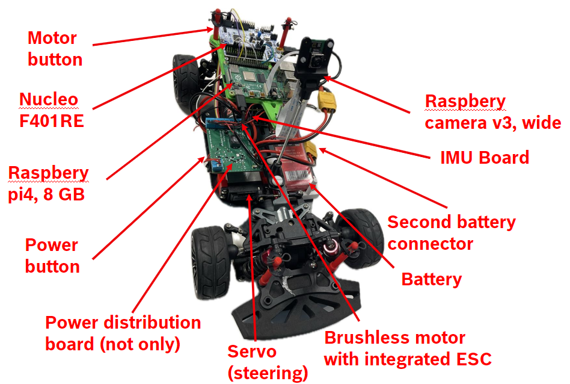
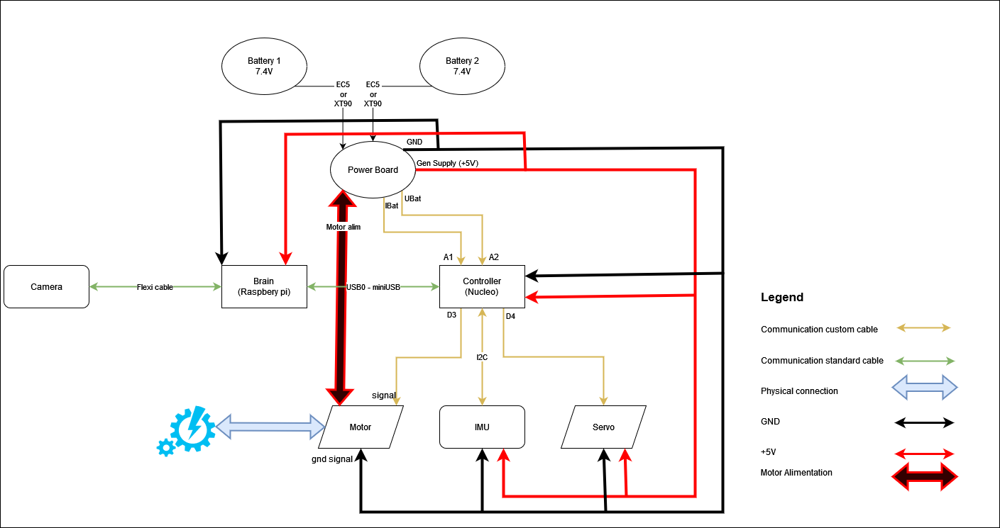

# Autonomous Driving Embedded System

## Connections Diagram

## The Components
- Chassis: [Reely TC-04](https://www.conrad.com/en/p/reely-tc-04-onroad-chassis-1-10-rc-model-car-electric-road-version-4wd-arr-1406735.html?refresh=true)
- Servo: [RS-610WP](https://www.conrad.com/en/p/reely-standard-servo-rs-610wp-mg-analogue-servo-gear-box-material-metal-connector-system-jr-2141322.html)
- Brushless motor with integrated ESC: [Quicrun Fusion SE, 1200KV](https://www.hobbywingdirect.com/collections/quicrun-fusion-se)
- Brain: [Raspberry Pi 4b 8GB RAM](https://www.raspberrypi.com/products/raspberry-pi-4-model-b/)
- Controller: [Nucleo F401RE](https://www.conrad.com/en/p/stmicroelectronics-pcb-design-board-nucleo-f401re-stm32-f4-series-1416924.html)
- Camera: [Camera Module 3](https://www.raspberrypi.com/products/camera-module-3/?variant=camera-module-3-wide)
- Battery: 2 cells LiPo battery, ranging from 4500 mAhto 6200 mAh [Link 1](https://www.conrad.com/en/p/conrad-energy-scale-model-battery-pack-lipo-7-4-v-5500-mah-no-of-cells-2-20-c-softcase-xt90-1344152.html), [Link 2](https://www.conrad.com/en/p/hacker-scale-model-battery-pack-lipo-74-v-5000-mah-no-of-cells-2-20-c-softcase-xt90-2178297.html), [Link 3](https://www.conrad.com/en/p/absima-scale-model-battery-pack-lipo-7-4-v-6200-mah-60-c-hard-case-xt90-2357348.html)
- IMU: [BNO055](https://www.proe.vn/adafruit-9-dof-absolute-orientation-imu-fusion-breakout-bno055)
- Charger: [VOLTCRAFT V-Charge Eco LiPo 3000](https://www.conrad.com/en/p/voltcraft-v-charge-eco-lipo-3000-scale-model-battery-charger-230-v-3-a-lipolymer-1409525.html)
- Car Body: [Link 1](https://www.eurorc.com/product/21265/killerbody-lexus-rc-finished-body-orange-190mm), [Link 2](https://hpi-racing.ro/acasa/caroserie-vopsita-ford-mustang-mach-e-1400-200mm.html), [Link 3](https://hpi-racing.ro/onroadtouringdrift/caroserie-hpi-3d-bmw-m3-gt2-e92200mm.html)